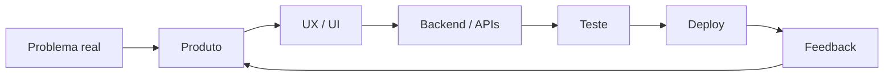

<div align="center">

# MIGUEL VIANA

### `product-minded developer • full-stack • systems • maps • AI`

**Eu não quero construir só páginas.
Quero construir produtos que pareçam vivos.**

</div>

---

```text
miguel@dev:~$ whoami

> Desenvolvedor focado em transformar ideias em produtos digitais.
> Gosto de trabalhar da interface até o backend, da experiência até a infraestrutura.
> Meu principal projeto hoje é o WeSafe / Spark.

miguel@dev:~$ current_focus

> Rotas adaptativas
> Mapas e geolocalização
> Sistemas web
> Experiências interativas
> Backend e APIs
> IA aplicada a produto
```

---

## ⚡ Sobre mim

Meu nome é **Miguel Viana**.

Eu gosto de projetos que misturam **engenharia, produto e experiência visual**.

Não curto a ideia de desenvolver uma interface bonita que não faz nada — nem um backend completo que parece impossível de usar. Meu objetivo é juntar os dois lados: criar sistemas que tenham **lógica forte por trás e uma experiência que faça sentido na frente**.

Grande parte do que estudo e desenvolvo nasce de uma pergunta simples:

> **“Como eu transformaria esse problema em um produto de verdade?”**

Hoje meu foco passa principalmente por:

* desenvolvimento **Full Stack**;
* Python e Flask;
* JavaScript;
* interfaces web responsivas;
* APIs;
* sistemas baseados em mapas;
* geolocalização;
* UX/UI;
* arquitetura de produto;
* inteligência artificial aplicada;
* Linux;
* deploy e infraestrutura web;
* segurança e networking como áreas de estudo.

---

# 🧭 WeSafe / Spark

<div align="center">

## **Rotas não deveriam considerar apenas distância.**

`EM DESENVOLVIMENTO`

**WeSafe / Spark é o projeto que melhor representa como eu penso produto.**

</div>

O WeSafe começou com uma ideia maior do que simplesmente desenhar uma linha entre dois pontos.

A proposta é construir um sistema de navegação capaz de trabalhar com **contexto**.

Além do caminho tradicional, o projeto explora informações como:

* trânsito;
* horário;
* segurança;
* contexto da região;
* micro-rotas;
* alternativas por quarteirão;
* posição atual do usuário;
* recálculo durante o trajeto.

A ideia é permitir diferentes estratégias de navegação:

### ⚡ Mais rápida

Prioriza tempo e eficiência de deslocamento.

### 🛡️ Mais segura

Dá mais peso ao contexto de segurança da rota.

### ✦ Spark

Busca um equilíbrio entre velocidade, contexto e qualidade do trajeto.

---

### O que existe por trás

```text
                       ┌─────────────────┐
                       │   Usuário / GPS │
                       └────────┬────────┘
                                │
                                ▼
                     ┌─────────────────────┐
                     │   Contexto da rota  │
                     │ trânsito • horário  │
                     │ segurança • região  │
                     └─────────┬───────────┘
                               │
                               ▼
                     ┌─────────────────────┐
                     │   Motor de decisão  │
                     │   WeSafe / Spark    │
                     └─────────┬───────────┘
                               │
                 ┌─────────────┼─────────────┐
                 ▼             ▼             ▼
             MAIS RÁPIDA   MAIS SEGURA      SPARK
```

### Stack / engenharia

`Python` `Flask` `JavaScript` `Mapbox` `SQLite` `Gunicorn` `Render` `OAuth` `Linux`

O projeto envolve:

* navegação GPS;
* câmera de navegação;
* recálculo de rota;
* métricas de percurso;
* sistema de pontuação;
* alertas/contexto comunitário;
* autenticação tradicional;
* Google OAuth / OpenID Connect;
* backend em Flask;
* APIs próprias;
* persistência de dados;
* deploy em produção;
* interface mobile-first.

### 🌐 Projeto

**WeSafe / Spark:**
https://wesafe-c7kg.onrender.com

> O sistema continua em desenvolvimento.
> Para mim, essa é justamente a parte mais interessante: testar, quebrar, revisar e transformar a ideia em algo cada vez mais próximo de um produto real.

---

# ◈ Vértice Web

Outro lado importante do que faço é a **Vértice Web**.

A Vértice nasceu como uma forma de transformar desenvolvimento web em uma entrega mais próxima de um produto comercial completo.

Não é só:

> “fazer um site”.

A ideia é pensar em:

```text
IDENTIDADE
    ↓
ESTRATÉGIA
    ↓
UX / UI
    ↓
DESENVOLVIMENTO
    ↓
PERFORMANCE
    ↓
CONVERSÃO
```

Os projetos da Vértice são construídos para negócios locais, lojas e serviços, com foco em:

* identidade própria;
* mobile-first;
* performance;
* clareza;
* interação;
* presença digital;
* CTAs;
* experiência visual;
* conversão.

---

## 🍔 BRASA 91

Uma hamburgueria criada como demonstração de como uma marca gastronômica pode ter uma presença digital muito mais forte do que um catálogo genérico.

O projeto explora:

* direção visual dark;
* tipografia de impacto;
* menu;
* produtos;
* combos;
* CTA de pedido;
* interações próprias;
* experiência responsiva.

Não é apenas mudar as cores de um template.

O objetivo foi construir uma identidade que faça sentido **para uma hamburgueria**.

---

## 🐾 Pingo Pet

Projeto voltado ao mercado pet.

A proposta muda completamente em relação ao BRASA 91:

* linguagem mais leve;
* experiência amigável;
* serviços organizados;
* planos;
* agendamento;
* conteúdo para diferentes tipos de pet;
* identidade visual própria;
* mobile-first.

Esses projetos fazem parte do meu laboratório de desenvolvimento comercial dentro da **Vértice Web**.

---

# 🧠 Outros projetos e experimentos

Meu portfólio também passa por produtos e conceitos em áreas diferentes.

### Nebula OS

Exploração de sistemas e experiência de ecossistema digital.

### LocalizAI

Experimentos envolvendo **geolocalização, mapas e produto**.

### Panda Flow

Projeto ligado a **IA aplicada e fluxos baseados em informação**.

### LinkTroPay

Exploração de **backend e produto no contexto financeiro**.

### Transfer Master

Sistema voltado ao universo de futebol, scouting e mercado.

O projeto trabalha com uma arquitetura que combina:

`React` + `Flask` + `APIs` + `dados` + `scoring` + `IA`

A ideia envolve recursos como:

* atletas;
* clubes;
* partidas;
* scouting;
* mercado;
* scoring;
* radar;
* projeções;
* relatórios;
* recomendações.

---

# 🛠️ Stack

### Backend


### Frontend


### Produto / Infra


### Mapas


---

# 🧩 Como eu gosto de construir



Meu processo quase nunca termina no primeiro deploy.

Eu prefiro:

1. construir;
2. testar;
3. identificar onde ficou ruim;
4. refazer;
5. otimizar;
6. testar novamente.

É por isso que muitos dos meus projetos passam por várias versões.

Para mim, **polimento também é engenharia**.

---

# 🐧 Linux

Linux faz parte do meu ambiente de desenvolvimento e aprendizado.

Uso o sistema não apenas para escrever código, mas também para entender melhor:

* processos;
* rede;
* servidores;
* ferramentas de terminal;
* deploy;
* debugging;
* infraestrutura;
* comportamento do sistema.

Também estudo **networking e segurança aplicada** como áreas complementares ao desenvolvimento.

---

# 🎯 O que estou buscando

Quero continuar evoluindo principalmente em projetos onde eu possa trabalhar com:

* produtos web;
* backend;
* sistemas;
* mapas;
* geolocalização;
* IA;
* experiências interativas;
* arquitetura;
* performance;
* problemas que não tenham uma solução óbvia.

Eu gosto principalmente quando um projeto exige que eu pare e pense:

> **“Como isso deveria funcionar de verdade?”**

---

<div align="center">

# `BUILD → BREAK → LEARN → REBUILD`

### Eu ainda estou construindo minha trajetória.

**E é exatamente por isso que você vai encontrar projetos vivos aqui.**

---

### Contato profissional / Vértice Web

📩 **[sac.vertice.web@gmail.com](mailto:sac.vertice.web@gmail.com)**

</div>
